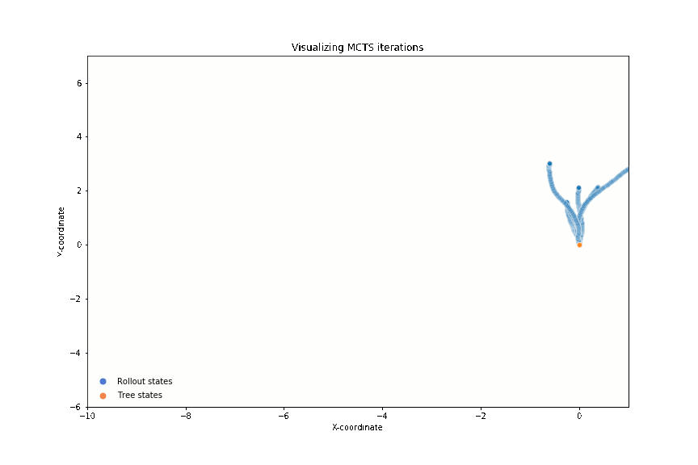

# PyRacecarSimulator
Simulator for simulating a F1-tenth car. Itegrated with ROS and uses range_libc
for lidar simulations. Implemented to facilitate a Monte-Carlo Tree Search agent.



## Depends

### ROS


* ROS melodic
* Ackermann Messeges
* LaserScan Messeges
* Pose Messges
* Geometry Messages
* RViz

### Other libs


* [range_libc](https://github.com/felrock/range_libc)
* Tensorflow 1.13, with cudaNN 7.3
* Numpy


## Installing

Put the project folder into a ros workspace and run,

```
catkin_make
source devel/setup.bash
```

## Usage

Tune the simulation and the agents using the param.yaml file. To change policy
for MCTS, edit **mcts.py** and swap out generateActionXX().


### Simulation only 


Build racecar
Build range_libc


To run the simulation as a ROS node run, 
```
roslaunch PyRacecarSimulator simulate.launch
```

### Simulation with MCTS

Build the libraries, 

```
bash racecar/compile.sh
bash range_libc/pywrapper/compile_with_cuda.sh
bash followthegap/compile.sh
```


To run the simulation as a ROS node run, 
```
roslaunch PyRacecarSimulator simulate.launch
```


Then run the MCTS agent,
```
roslaunch PyRacecarSimulator mcts_driver.launch
```

# TODO
* Add multi-agent capabilities
* Add support for incremental map updates
* Try other roll-out policies

# Acknowledgements
Thanks to the code below we were able to create this project.


* [mit-racecar](https://mit-racecar.github.io)
* [range_libc](https://github.com/kctess5/range_libc)
* [racecar_simulator](https://github.com/mlab-upenn/racecar_simulator)
